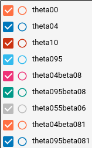
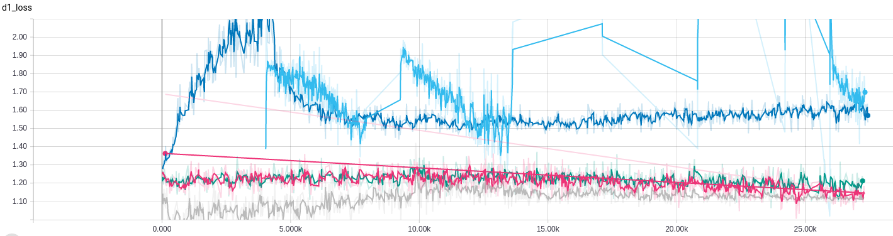
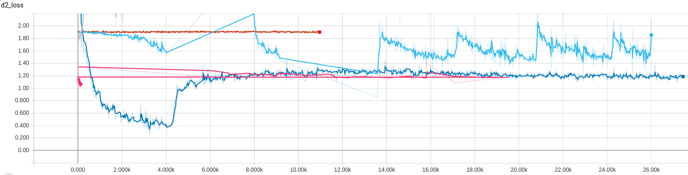
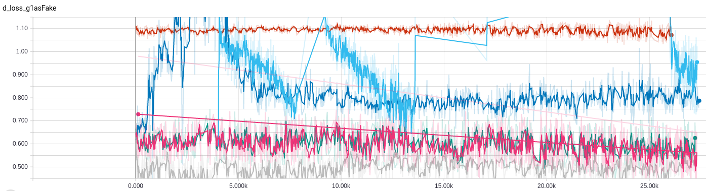
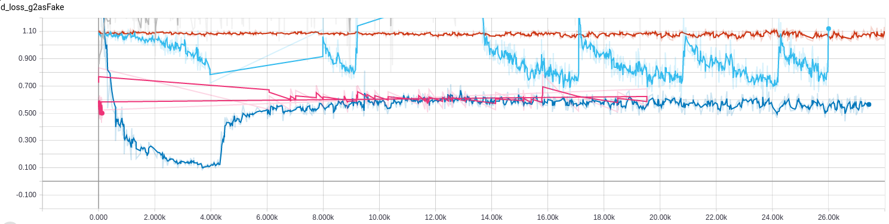
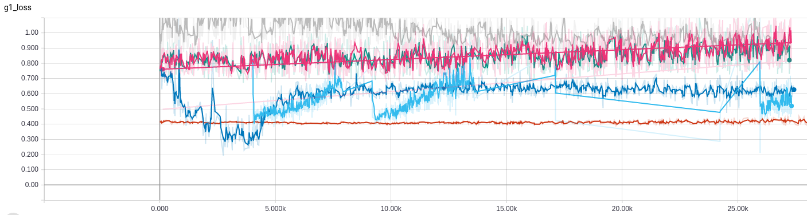
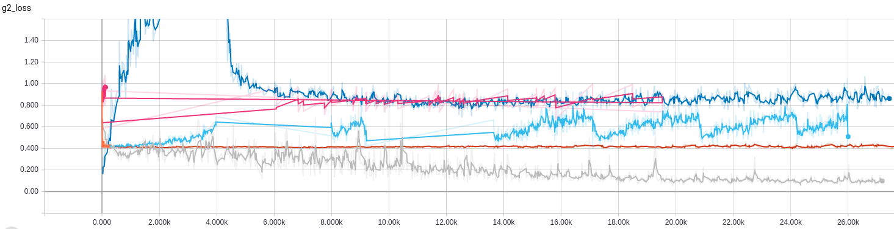

# deep GAN
[]()

deep GAN experiment.

### Main idea
Multiple generators cooperate to improve generative ability under the competitive selection of one discriminator

# Requirement
* tensorflow
* numpy

# Usage
**Step 1.** Clone this repository and adjust the environment setting in ``main.py`` if necessary.

Ensure your system is installed with Git and clone this reposity with command line:

```
$ git clone https://github.com/naturomics/deepGAN.git
```
``cd deepGAN `` and edit file 'main.py' to suit your configuration.

**Step 2.** Download [MNIST dataset](http://yann.lecun.com/exdb/mnist/) and ``mv`` them into ``data/mnist`` directory.
```
$ mkdir -p data/mnist
$ cd data/mnist
$ wget -c http://yann.lecun.com/exdb/mnist/{train-images-idx3-ubyte.gz,train-labels-idx1-ubyte.gz,t10k-images-idx3-ubyte.gz,t10k-labels-idx1-ubyte.gz}
$ cd ../../   # go back to project root directory
```

**Step 3.** Start to run with command line:
```
$ python main.py
```

# Results

## Training Loss
Experiments were carried out with different hyper parameters **theta** and **beta**

The legend for various hyper parameters(theta00 meaning theta=0.0 and no using beta, theta04beta08 i.e. theta=0.4 and beta=0.8, etc.):


d1 total loss:


d2 total loss:


d loss with g1 as fake input:


d loss with g2 as fake input:


g1 loss:


g2 loss:

